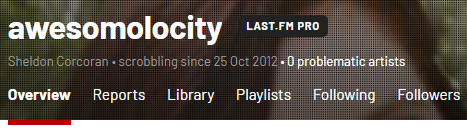

# Last.FM Problematic Artist Checker

A userscript that will check a last.fm user profile for any problematic artists. (AKA: Nazi / Nazi sympathizer / related questionable content) **It is worth noting that having scrobbles for problematic artists does not mean the user is also problematic.**

## Installation

1. Make sure you have user scripts enabled in your browser (these instructions refer to the latest versions of the browser):

    * [Tampermonkey](https://www.tampermonkey.net/) (proprietary)
    * [Violentmonkey](https://violentmonkey.github.io/get-it/)
    * [Greasemonkey](https://addons.mozilla.org/firefox/addon/greasemonkey/)

2. [Click this link to install the userscript](https://github.com/Awesomolocity/Lastfm-Problematic-Artist-Checker/raw/main/index.user.js)

## Updating

The script is set to automatically update (theoretically). You can check for updates from within the Greasemonkey or Tampermonkey menu, or click the installation link again to get an update. If you ever find yourself running an outdated version, you can remove the script and reinstall.

## Usage

- Go to a user's Overview profile page `https://last.fm/user/<username>`
- It can take a few seconds, but when it's done getting the count, you'll see a display beneath the username. (See below)

### Notes

- **This does not check *all* scrobbles**. It only checks recent scrobbles, top artists, top albums, and top tracks.
- The artists are listed in a Google spreadsheet [here](https://docs.google.com/spreadsheets/d/13_hUUbGqd_La2Zmmz55Zt6DJTDB_RtE7ZhzlOAWJzrs/edit?usp=sharing)
